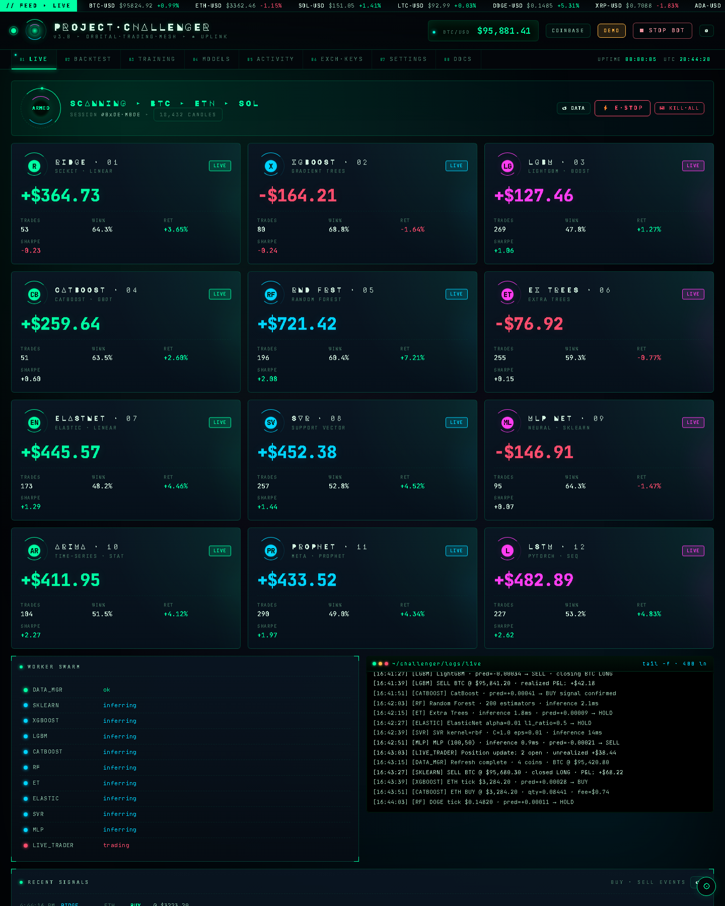
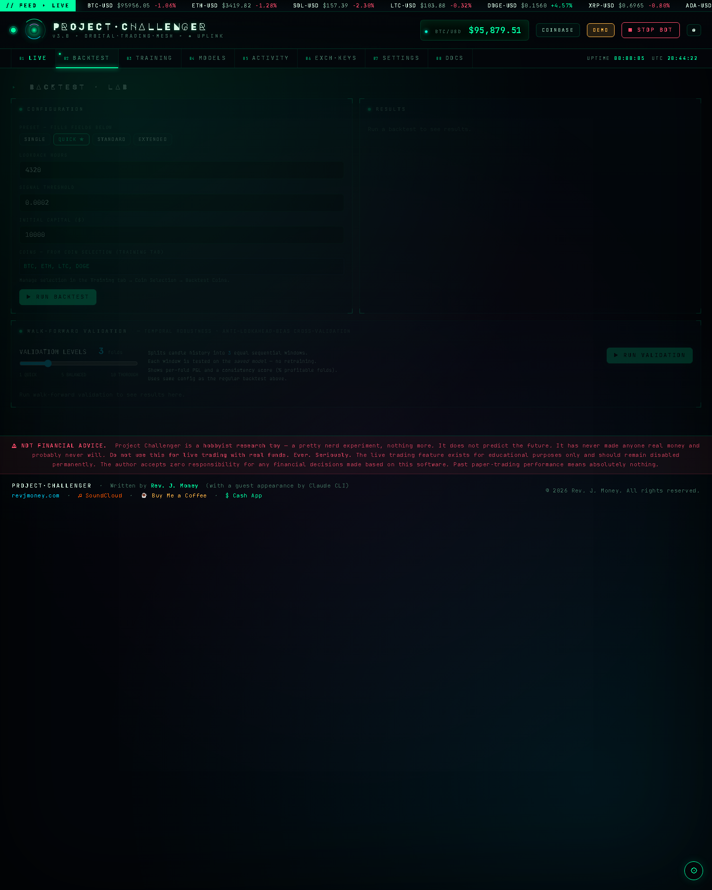
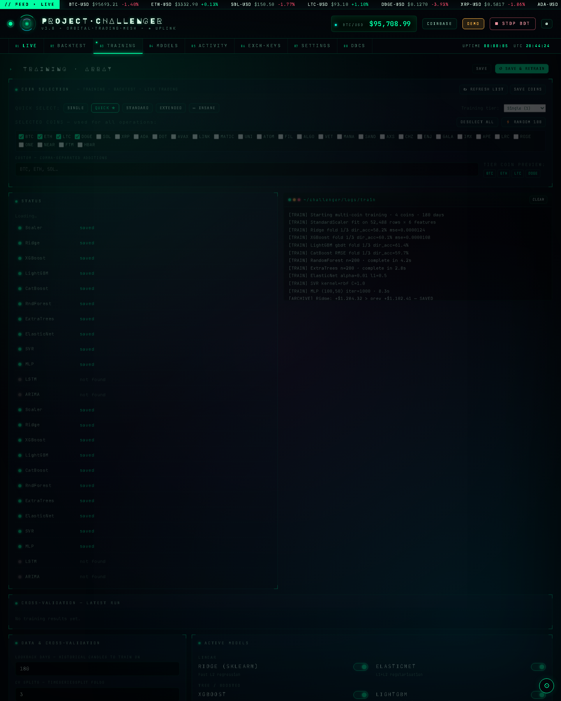
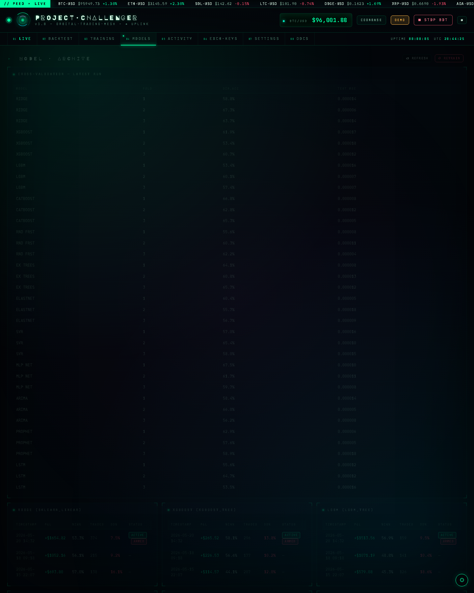
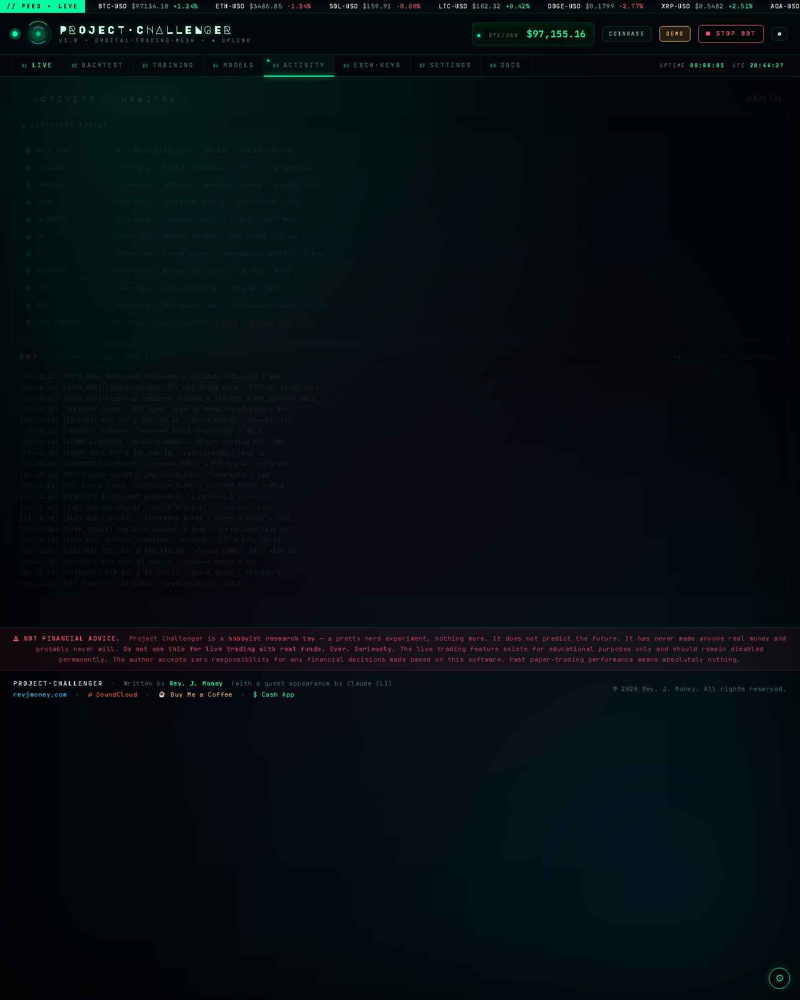
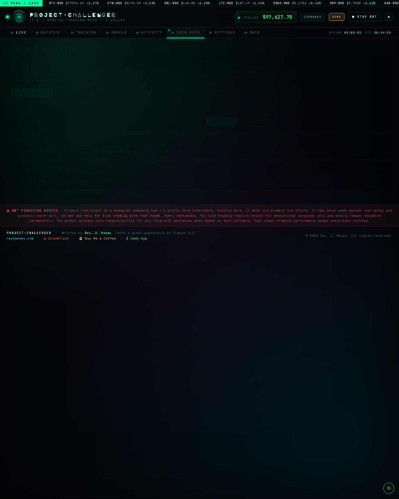
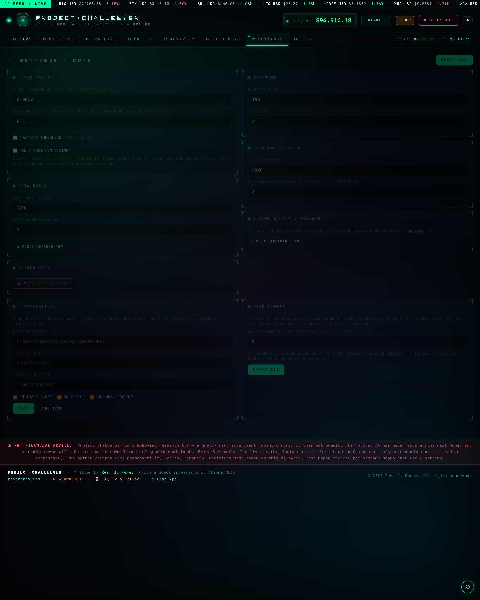
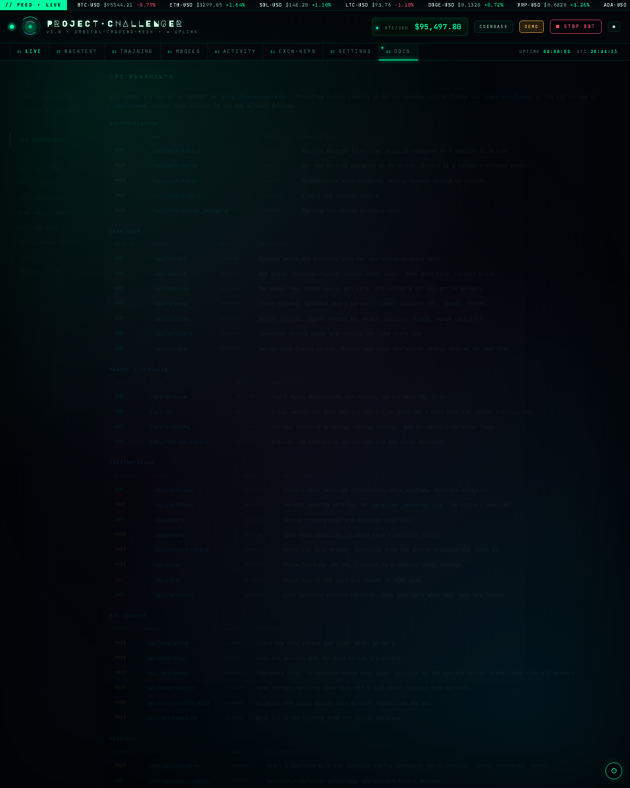

# Project Challenger
### Multi-Model Crypto Paper-Trading Bot with Parallel ML Comparison

> **Orchestrated by [Rev. J. Money](https://revjmoney.com)** · with a guest appearance by Claude CLI  
> 🎵 [soundcloud.com/revjmoney](https://soundcloud.com/revjmoney) · [Non-commercial learning/research license](LICENSE)
>
> ⚠ **Not financial advice.** This is a hobbyist research toy. Do not use it to trade real money.
>
> © 2026 Rev. J. Money. Code is licensed under PolyForm Noncommercial 1.0.0.
> Attribution is required for any permitted reuse. See [LICENSE](LICENSE) and [NOTICE](NOTICE).

Project Challenger ingests live market data from Coinbase, Binance, or Kraken,
runs up to **twelve machine learning models in parallel** on separate CPU cores,
paper-trades each independently, archives every trained model with its backtest
P&L, and promotes the best-performing model to live trading automatically.
Results are accessible through a **browser-based Web GUI** or a rich terminal TUI —
your choice, same backend.

---

## Web GUI Screenshots

| LIVE | BACKTEST |
|---|---|
|  |  |

| TRAINING | MODELS |
|---|---|
|  |  |

| ACTIVITY | EXCH-KEYS |
|---|---|
|  |  |

| SETTINGS | DOCS |
|---|---|
|  |  |

---

## Table of Contents

1. [What it does](#what-it-does)
2. [Prerequisites](#prerequisites)
3. [Installation](#installation)
4. [Quick Start](#quick-start)
5. [Web GUI](#web-gui)
   - [Live Tab](#tab-1--live)
   - [Backtest Tab](#tab-2--backtest)
   - [Training Tab](#tab-3--training)
   - [Models Tab](#tab-4--models)
   - [Activity Tab](#tab-5--activity)
   - [Exchange & Keys Tab](#tab-6--exchange--keys)
   - [Settings Tab](#tab-7--settings)
6. [Interactive Controller — TUI](#interactive-controller--tui)
7. [Configuration Guide](#configuration-guide)
8. [How the Models Work](#how-the-models-work)
9. [Model Archive System](#model-archive-system)
10. [Scientific Methodology](#scientific-methodology)
11. [Going Live with Coinbase](#going-live-with-coinbase)
12. [Architecture Overview](#architecture-overview)
13. [File Reference](#file-reference)
14. [Troubleshooting](#troubleshooting)
15. [License and Attribution](#license-and-attribution)
16. [Support the Project](#support-the-project)
17. [Credits](#credits)

---

## What it does

```
Exchange WebSocket  (Coinbase / Binance / Kraken — live prices + order book)
         │
         ▼
  Feature Engine  (RSI-14, ATR-14, EMA-diff, Log Return, Rolling Vol, OBI)
         │
    [broadcast thread]
    ┌────┬────┬────┬────┬────┬────┬────┬────┬────┐
    ▼    ▼    ▼    ▼    ▼    ▼    ▼    ▼    ▼    (+ LSTM / ARIMA / Prophet if enabled)
  Ridge XGB  LGBM Cat  RF   ET  Elastic SVR  MLP
  (CPU)(CPU)(CPU)(CPU)(CPU)(CPU) (CPU) (CPU)(CPU)
    │    │    │    │    │    │    │    │    │
    ▼    ▼    ▼    ▼    ▼    ▼    ▼    ▼    ▼
              Paper Trade Logger (per model)
                         │
                   SQLite Database
                         │
                  ┌──────┴──────┐
                  ▼             ▼
               Web GUI      TUI (controller.py)
               FastAPI/SSE  Textual terminal
               (browser)    (local only)
```

**PAPER mode** — no keys needed for simulated trading.  
**Live mode** — real exchange WebSocket; Coinbase also shows your account balance.  
All active models evaluate on **identical candle timestamps** and **shared CV folds**
for a scientifically valid comparison. Up to **twelve models** can run in parallel —
nine fast CPU models on by default, plus optional LSTM, ARIMA, and Prophet.

After every training run, each model is scored by a full backtest.  Only a model
that beats the current archive champion is saved.  The highest-P&L engine across
all three is automatically armed as the active trading model.

---

## Prerequisites

| Requirement | Notes |
|---|---|
| Python 3.10 – 3.14 | [python.org/downloads](https://www.python.org/downloads/) |
| pip + venv | Included with Python |
| ~500 MB disk (CPU-only) | ~2.5 GB extra for a CUDA PyTorch build |
| NVIDIA GPU (optional) | Speeds up LSTM training only — not required |
| Exchange account (optional) | Not needed in PAPER mode |
| Modern browser (Web GUI) | Chrome, Firefox, Edge, Safari — any |

---

## Installation

> **Per-machine installs** — Each install is tied to the machine it was first set up on.
> If you move to a new computer or reinstall your OS, do a fresh `git clone` and run the
> launcher from there — it handles everything automatically. Do not copy or move the install
> folder between machines. This helps the developer track real usage and keep development going.

### Manual install (any OS)

```bash
python -m venv .venv

# Activate:
# Windows:    .venv\Scripts\activate
# Linux/Mac:  source .venv/bin/activate

# Pick ONE torch build:
pip install torch --index-url https://download.pytorch.org/whl/cpu      # CPU-only (~300 MB)
pip install torch --index-url https://download.pytorch.org/whl/cu121    # CUDA 12.1 (~2.5 GB)
pip install torch --index-url https://download.pytorch.org/whl/cu118    # CUDA 11.8

# Install everything else (includes FastAPI + uvicorn for the Web GUI):
pip install -r requirements.txt
mkdir -p data models/archive/sklearn models/archive/xgboost models/archive/pytorch docs
```

---

## Quick Start

### The launcher (recommended — Windows & Linux)

Both launchers handle everything automatically: first-run venv setup, directory
creation, database initialisation, server start, and browser open.

**Windows:**
```bat
launcher.bat
```

**Linux / macOS:**
```bash
./launcher.sh
```

On first run, the launcher creates the virtual environment and installs all
dependencies before starting. Subsequent runs activate the existing venv and
go straight to the server.

Once running, the console shows a live status panel that refreshes every 3 seconds:

```
 ================================================================
  ⚡  PROJECT CHALLENGER  |  WEB GUI
 ================================================================
  Status:   RUNNING  (PID 12345)
  Web:      http://localhost:8765
  Log:      logs/web_app.log  (42 KB / 4200 KB max)
 ----------------------------------------------------------------
  Recent activity:
 ----------------------------------------------------------------
  [INFO] Bot started — PAPER mode
  [DATA] Candle cache refreshed — 1440 bars
  ...
 ================================================================
  q = quit
 ================================================================
  >
```

Press `q` + Enter (Linux/macOS) or just `q` (Windows) to stop the server cleanly.

---

### Direct launchers

| Platform | Web GUI | TUI |
|---|---|---|
| Windows | `run_web.bat` | `run_controller.bat` |
| Linux/macOS | `./run_web.sh` | `python controller.py` |

---

### First-run flow

1. Run `launcher.bat` (Windows) or `./launcher.sh` (Linux/macOS).
2. On first run, venv setup and dependency installation happen automatically.
3. Browser opens to `http://localhost:8765` after the server is ready.
4. If no models exist, training starts automatically — watch the **Training** tab.
5. Training finishes (5–15 min CPU / <1 min GPU) → models archived → bot starts.
6. **Live** tab shows real-time P&L cards, open positions, and trade history.

---

### Accessing from another machine on your network

The web server binds to `0.0.0.0:8765` by default, so any device on the same
LAN can reach it:

```
http://<server-ip>:8765
```

To lock it to localhost only:
```bash
python web_app.py --host 127.0.0.1
```

---

## Web GUI

The Web GUI is a self-contained single-page app served by FastAPI with
Server-Sent Events for live updates — no CDN, no external dependencies,
works on any LAN or air-gapped machine.

Seven tabs, all driven by the same `BotManager` backend that the TUI uses.

---

### Tab 1 — Live

**P&L cards** — one card per model (Ridge / XGBoost / LSTM), updated every 2 s:
- Net P&L in dollars (green/red)
- Trade count, Win%, Return%
- Bot start / stop buttons and candle count badge

**⚡ E-STOP button** — top-right of the Live tab header. One click (with confirmation) force-closes
every open paper position at the current market price, disarms live trading, and stops all workers.
Closing trades are written to the database so history stays complete.

**Worker Status** — live component health grid (DATA_MGR, SKLEARN, XGBOOST, PYTORCH, LIVE_TRADER)
with colour-coded status and last message.

**Recent Log** — rolling bot log, scrollable.

**Open Positions** — table of the current in-flight paper position for each model:

| Model | Side | Quantity | Unrealised P&L |
|---|---|---|---|
| Ridge | LONG | 0.001523 | +$1.42 |

**Recent Trades** — last 50 closed paper trades with a model filter dropdown:

| Time | Model | Side | Price | Qty | Fee | P&L |
|---|---|---|---|---|---|---|
| 14:32:01 | Ridge | BUY | 67 210.00 | 0.001489 | $0.60 | — |
| 14:31:47 | XGBoost | SELL | 67 184.50 | 0.001491 | $0.60 | +$3.21 |

Trades auto-refresh every 15 s; manual refresh button available.

---

### Tab 2 — Backtest

Run historical replay through all active models.

**Configuration card:**

| Field | Default | Notes |
|---|---|---|
| Lookback Hours | 720 | Up to 8760 (365 days) |
| Signal Threshold | 0.0002 | Min log-return to trade |
| Initial Capital | $10 000 | Per model |
| Coins | BTC, ETH, LTC, DOGE | Comma-separated base names |

Click **▶ Run Backtest** — results appear as they complete.

**Summary results** (first coin, all models):

| Model | Trades | Win% | P.Factor | Net P&L | Max DD |
|---|---|---|---|---|---|
| Ridge | 214 | 53.3% | 1.62 | +$1 240 | 8.2% |

**Per-coin breakdown** — if multiple coins were selected, a full results table per
coin is shown below the summary.

---

### Tab 3 — Training

**Coin Selection card** — controls what data the models train and backtest on:

| Control | Description |
|---|---|
| **Training Tier** | `single` (BTC) / `standard` (BTC+ETH+LTC+DOGE) / `extended` (10 coins) / `insane` (all on exchange) |
| **Active Trading Coin** | Which coin the live/paper bot trades |
| **Backtest Coins** | Checkboxes for per-coin backtest; custom field for extras |
| **↻ Refresh List** | Fetches the full product list from the active exchange and caches it |
| **Save Coins** | Persists the current coin settings |

> The `insane` tier trains on every USD-quoted spot coin the exchange offers.
> Click **↻ Refresh List** first to populate the full product catalogue.

**Status card** — model file presence (scaler / Ridge / XGBoost / LSTM), last trained timestamp.

**Training Log** — filtered live log showing only training-related output (fold metrics, epoch losses, save confirmations).

**Cross-Validation results** — direction accuracy and MSE per model per fold, from the most recent training run.

**Hyperparameter settings** — every tunable parameter exposed with labels and hints:

*Data & CV:* Lookback Days, CV Splits  
*Active Models:* Ridge / XGBoost / LSTM toggles  
*Ridge:* Alpha (L2 regularisation)  
*XGBoost:* n_estimators, max_depth, learning rate, subsample, colsample  
*LSTM:* sequence length, hidden size, layers, dropout, epochs, batch size, learning rate

**Save Settings** — persists to `data/user_settings.json`.  
**⚙ Save & Retrain** — saves settings then triggers a full retrain from scratch.

---

### Tab 4 — Models

**Archive per engine** — up to 3 entries each, best-first:

| Timestamp | P&L | Status |
|---|---|---|
| 2026-05-20 14:30 | +$312.45 | **active** **armed** |
| 2026-05-20 09:15 | +$187.23 | archived |

**CV Training Scores** — directional accuracy and MSE per model from the latest run.

---

### Tab 5 — Activity

Full per-component status table: `DATA_MGR`, `SKLEARN`, `XGBOOST`, `PYTORCH`, `BACKTESTER`, `LIVE_TRADER` — colour-coded status + last message.

Scrollable activity log (last 500 lines).

---

### Tab 6 — Exchange & Keys

- **Exchange selector** — Coinbase / Binance / Kraken (restart bot to apply).
- **Coinbase API Keys** — enter key + secret directly; saved to `data/.secrets.json` using local OS protection where available. Clear with one click to revert to paper mode.
- **Connection status** — shows PAPER mode warning or confirmed live exchange + symbol.
- **Coinbase Account Balance** — live balance table auto-refreshing every 30 s when real keys are loaded.

---

### Tab 7 — Settings

| Section | Controls |
|---|---|
| Paper Trading | Signal threshold, position size % |
| Data Cache | Max cache hours, refresh interval (min) |
| Backtest Defaults | Default lookback hours |
| Training Defaults | Lookback days, CV splits |

**Apply & Save** — persists all settings immediately; no restart needed.

---

## Interactive Controller — TUI

`controller.py` is the alternative terminal-based interface. All the same
functionality, no browser required. Useful over SSH or when running headless on a server
where you want a local terminal view.

```
┌─ Project Challenger ───────────────────────────────────────── 14:32:07 ─┐
│ [▶ Start] [■ Stop] [⟳ Retrain] [↺ Fresh Data] [✕ Reset DB] [≡ Compare] │
│                                                       ● RUNNING PAPER    │
├── Live Trading ─┬─ Backtest ─┬─ Models ─┬─ Activity ─┬─ Exchange&Keys ─┬─ Settings ─┤
│                                                                           │
│  (active tab content here)                                                │
│                                                                           │
├───────────────────────────────────────────────────────────────────────────┤
│  LOG                                                                      │
│  [14:32:01]  Bot started — PAPER — 3 model(s) active                     │
└───────────────────────────────────────────────────────────────────────────┘
  s Start  x Stop  t Retrain  b Backtest  c Compare  a Activity  q Quit
```

### Launching the TUI

```bash
# From the launcher:
launcher.bat / ./launcher.sh  →  [2] TUI

# Direct:
python controller.py
python controller.py --no-autostart   # open without auto-starting the bot
```

### Tab summary

| Tab | Key content |
|---|---|
| Live Trading | P&L table per model, worker dots, right sidebar with model toggles |
| Backtest | Config panel + results table; runs all models in parallel |
| Models | CV scores + per-engine archive (top 3 checkpoints) |
| Activity | Component status table + rolling 500-line event log |
| Exchange & Keys | Exchange selector, key file loader, Coinbase balance panel |
| Settings | Data windows, signal threshold, live trading gate + ARM button |

### Keyboard shortcuts

| Key | Action |
|---|---|
| `s` | Start |
| `x` | Stop |
| `t` | Retrain |
| `b` | Run Backtest |
| `c` | Compare report |
| `a` | Switch to Activity tab |
| `q` | Quit |

---

## Configuration Guide

All settings live in **`config.py`**. The Settings tab (both Web GUI and TUI) persists
runtime overrides to `data/user_settings.json` (loaded at startup, survives restarts).

### Exchange

```python
"EXCHANGE": "COINBASE",   # "COINBASE" | "BINANCE" | "KRAKEN"
```

Binance and Kraken use public endpoints — no API keys needed for market data.

### Coinbase

```python
"COINBASE": {
    "API_KEY":    "YOUR_API_KEY_HERE",   # leave as-is for PAPER mode
    "API_SECRET": "YOUR_API_SECRET_HERE",
    "PRODUCT_ID":  "BTC-USD",
    "GRANULARITY": "FIFTEEN_MINUTE",     # 15-min candles
},
```

### Coin selection

```python
"COINS": {
    "TRAINING_TIER":  "standard",              # single|standard|extended|insane
    "TRADING_COIN":   "BTC",                   # active paper/live trading coin
    "BACKTEST_COINS": ["BTC", "ETH", "LTC", "DOGE"],
},
```

Training tiers:

| Tier | Coins | Use case |
|---|---|---|
| `single` | BTC | Fastest retrain, minimal data |
| `quick` | BTC, ETH | Good for a fast sanity check |
| `standard` | BTC, ETH, LTC, DOGE | Default — good balance |
| `extended` | 10 coins (+ XRP, SOL, ADA, DOT, AVAX, LINK) | Richer generalisation |
| `insane` | All USD-quoted coins on the exchange | Maximum coverage |

### Active models

```python
"ACTIVE_MODELS": {
    # Fast / always-on
    "SKLEARN_LINEAR": True,    # Ridge regression
    "XGBOOST_TREE":   True,    # XGBoost
    "LGBM_TREE":      True,    # LightGBM  (pip install lightgbm)
    "CATBOOST_TREE":  True,    # CatBoost  (pip install catboost)
    "RF_TREE":        True,    # Random Forest
    "ET_TREE":        True,    # Extra Trees
    "ELASTIC_LINEAR": True,    # ElasticNet
    "SVR_KERNEL":     True,    # Support-Vector Regression
    "MLP_NN":         True,    # MLP Neural Net (sklearn)
    # Optional / slower
    "PYTORCH_LSTM":   False,   # LSTM — slow on CPU, fast on CUDA
    "ARIMA_STATS":    False,   # ARIMA  (pip install statsmodels)
    "PROPHET_FB":     False,   # Prophet (pip install prophet)
},
```

### Training

```python
"TRAINING": {
    "LOOKBACK_DAYS":    180,   # 6 months of 15-min bars (~17 000 bars)
    "N_SPLITS":         3,     # TimeSeriesSplit folds

    # LSTM
    "SEQUENCE_LENGTH":  20,    # rolling input window (candles)
    "LSTM_HIDDEN_SIZE": 64,
    "LSTM_LAYERS":      2,
    "LSTM_DROPOUT":     0.2,
    "LSTM_EPOCHS":      5,     # raise to 20+ with a CUDA GPU
    "LSTM_BATCH_SIZE":  64,
    "LSTM_LR":          0.001,

    # Ridge
    "RIDGE_ALPHA":      1.0,   # L2 regularisation strength

    # XGBoost
    "XGB_N_ESTIMATORS": 200,
    "XGB_MAX_DEPTH":    4,
    "XGB_LR":           0.05,
    "XGB_SUBSAMPLE":    0.8,
    "XGB_COLSAMPLE":    0.8,

    # LightGBM
    "LGBM_N_ESTIMATORS": 200,
    "LGBM_MAX_DEPTH":    -1,   # -1 = unlimited
    "LGBM_LR":           0.05,
    "LGBM_SUBSAMPLE":    0.8,
    "LGBM_COLSAMPLE":    0.8,
    "LGBM_BOOSTING":     "gbdt",   # gbdt | dart | goss

    # CatBoost
    "CATBOOST_ITERATIONS": 200,
    "CATBOOST_DEPTH":      6,
    "CATBOOST_LR":         0.05,
    "CATBOOST_LOSS":       "RMSE",  # RMSE | MAE | Quantile

    # Random Forest
    "RF_N_ESTIMATORS":   200,
    "RF_MAX_DEPTH":      10,

    # Extra Trees
    "ET_N_ESTIMATORS":   200,
    "ET_MAX_DEPTH":      10,

    # ElasticNet
    "ELASTIC_ALPHA":     0.1,
    "ELASTIC_L1_RATIO":  0.5,  # 0 = Ridge, 1 = Lasso

    # SVR
    "SVR_C":             1.0,
    "SVR_EPSILON":       0.1,
    "SVR_KERNEL_TYPE":   "rbf",  # rbf | linear | poly

    # MLP
    "MLP_HIDDEN_LAYERS": "100,50",
    "MLP_MAX_ITER":      500,
    "MLP_LR":            0.001,

    # ARIMA
    "ARIMA_P":           2,
    "ARIMA_D":           0,
    "ARIMA_Q":           2,
    "ARIMA_WINDOW":      500,  # rolling-window size for live inference

    # Prophet
    "PROPHET_CHANGEPOINTS": 25,
    "PROPHET_SEASONALITY":  False,
    "PROPHET_WINDOW":       1000,
},
```

All hyperparameters can also be tuned live via the **Training tab** in the Web GUI without editing this file.

### Paper trading

```python
"PAPER_TRADING": {
    "INITIAL_CAPITAL":        10_000.0,
    "POSITION_SIZE_PCT":       0.10,     # 10% of capital per trade
    "SIMULATED_SLIPPAGE_PCT":  0.0005,   # 0.05%
    "COINBASE_FEE_PCT":        0.015,    # 1.5% default taker fee (auto-fetched if keys present)
    "SIGNAL_THRESHOLD":        0.008,    # min predicted log-return to trade on (~covers fee per leg)
    "ZERO_OBI_IN_INFERENCE":   True,     # keep OBI=0 in live inference to match training distribution
    "MAX_DRAWDOWN_PCT":        0.0,      # kill-switch; 0 = disabled; e.g. 15.0 = stop at 15% drawdown
},
```

### Notifications

Discord and Telegram webhooks are optional. Leave blank to disable.

```python
"NOTIFICATIONS": {
    "DISCORD_WEBHOOK":  "",   # full Discord webhook URL
    "TELEGRAM_TOKEN":   "",   # bot token from @BotFather
    "TELEGRAM_CHAT_ID": "",   # numeric chat/channel ID
    "ON_TRADE":         True, # notify on each paper trade close
    "ON_ESTOP":         True, # notify on emergency stop
    "ON_PROMOTE":       True, # notify when a new model is promoted to active
    "ON_DRAWDOWN":      True, # notify when max-drawdown kill switch triggers
},
```

---

## How the Models Work

All active models predict the **next candle's log return**.
Above `+SIGNAL_THRESHOLD` → LONG.  Below `-SIGNAL_THRESHOLD` → SHORT.

### Features (shared by all models)

| Feature | Description |
|---|---|
| `log_return` | `log(close_t / close_{t-1})` |
| `rsi_14` | Relative Strength Index, 14-period |
| `atr_14` | Average True Range, 14-period |
| `ema_diff` | `(EMA12 − EMA26) / EMA26` |
| `rolling_vol_20` | 20-candle std dev of log returns |
| `obi` | Order Book Imbalance: `(bid_vol − ask_vol) / total_vol` |

A single `StandardScaler` is fitted once on the full combined training set
and shared by all three models and live inference.

When training on multiple coins (standard tier and above), features are computed
independently per coin and then concatenated — the scaler sees the full distribution
across all markets.

### Fast / always-on models (enabled by default)

| Key | Model | Notes |
|---|---|---|
| `SKLEARN_LINEAR` | Ridge Regression | L2 regularisation; near-zero inference latency. The baseline. |
| `XGBOOST_TREE` | XGBoost | Gradient-boosted trees; captures non-linear feature interactions. |
| `LGBM_TREE` | LightGBM | Fast gradient boosting; requires `pip install lightgbm`. |
| `CATBOOST_TREE` | CatBoost | Gradient boosting with built-in categorical handling; requires `pip install catboost`. |
| `RF_TREE` | Random Forest | Bagged decision trees; robust to noise. |
| `ET_TREE` | Extra Trees | Randomised splits; faster than Random Forest. |
| `ELASTIC_LINEAR` | ElasticNet | Combined L1+L2 regularisation. |
| `SVR_KERNEL` | Support-Vector Regression | Kernel-based; good on smaller datasets. |
| `MLP_NN` | MLP Neural Net | sklearn multi-layer perceptron; no CUDA needed. |

### Optional / slower models (disabled by default)

| Key | Model | Notes |
|---|---|---|
| `PYTORCH_LSTM` | PyTorch LSTM | 2-layer LSTM → linear head; processes the last 20 candles as a sequence. Auto-uses CUDA; slow on CPU. Set `False` on CPU-only machines. |
| `ARIMA_STATS` | ARIMA | Statsmodels rolling-window ARIMA; requires `pip install statsmodels`. |
| `PROPHET_FB` | Prophet | Facebook Prophet rolling-window; requires `pip install prophet`. |

**CPU-only install:** `torch.compile()` is automatically skipped for the LSTM worker — it falls back to standard eager execution. No configuration change needed.

---

## Model Archive System

After every successful retrain the following steps run automatically:

1. **Score** — full backtest on each freshly trained model using cached candle data.
2. **Gate** — a model is only archived if its backtest P&L **strictly beats** the
   current best in the archive for that engine. Worse models are discarded.
3. **Archive** — the model file is copied to `models/archive/<engine>/` with the
   timestamp and P&L in the filename:
   ```
   sklearn_20260520_143022_pnl+245.67.pkl
   xgboost_20260520_143022_pnl+312.45.pkl
   pytorch_20260520_143022_pnl+401.12.pt
   ```
4. **Prune** — only the top-3 by P&L are kept; older/worse files are deleted.
5. **Promote** — the best archive entry for each engine is copied to the active
   model slot (`models/sklearn_model.pkl`, etc.).
6. **Arm** — `ARMED_MODEL` config key is updated to whichever engine has the
   highest P&L across all three archives.

The archive is visible in the **Models** tab of both interfaces. If no model improves
across several retrains, the archive and active models are left unchanged.

---

## Scientific Methodology

### Shared CV folds
`TimeSeriesSplit` indices are computed once and saved to `data/cv_folds.pkl`.
Every model is trained and validated on **identical row ranges** — no model gets an easier window.

### Sequence alignment
Because LSTM needs a 20-candle look-back, the first 20 rows of each fold are
unusable. **All models skip those same rows** so predictions occur at identical timestamps.

### Identical normalisation
One `StandardScaler` fitted once on the full training set, shared by all active models.

### Identical friction simulation
All paper traders apply the same slippage (0.05%), fee (1.5% default taker — auto-fetched from Coinbase if keys are present), and starting capital ($10 000) regardless of model.

### Multi-coin training
When using `standard` tier or above, candles are fetched for each coin independently,
features are computed per coin, and the resulting rows are concatenated before fitting
the scaler and training models. This exposes the models to broader market behaviour
without leaking price-scale information across coins.

### Metrics to watch

| Metric | What it means |
|---|---|
| **Dir Accuracy** | Does the model get up/down right? (>50% = useful signal) |
| **Profit Factor** | Gross profit ÷ gross loss (>1.5 viable, >2.0 strong) |
| **Net PnL** | Bottom-line paper profit after all friction |
| **Win Rate** | % of closed trades that were profitable |
| **Max Drawdown** | Worst peak-to-trough capital loss |

---

## Going Live with Coinbase

> **No real orders are placed by default.** Live trading requires an explicit
> ARM action and all gate conditions must be met first.

**Via Web GUI:**
1. Go to the **Exchange & Keys** tab → enter your Coinbase API key + secret → Save.
2. Go to **Settings** → confirm all live-trading gate items are satisfied.
3. Check `"ENABLED": True` under `LIVE_TRADING` in `config.py`.
4. The ARM button becomes available once all gates are green.

**Via TUI:**
1. **Exchange & Keys** tab → enter the key file path → Load from File.
2. **Settings** tab → verify all gate items show ✓ → click **ARM LIVE TRADING**.

Keys are saved to `data/.secrets.json` using local OS protection where available. Legacy `data/api_keys.json` files are migrated on startup.

Gate conditions (all must be green):
- `LIVE_TRADING.ENABLED = True` in `config.py`
- Real API keys loaded (not demo placeholders)
- Minimum paper-trading duration met (`MIN_PAPER_HOURS`, default 24 h)
- Minimum paper return % met (`MIN_PAPER_PNL_PCT`, default 1.0%)

The full live trading block in `config.py`:

```python
"LIVE_TRADING": {
    "ENABLED":                      False,          # master switch
    "ARMED_MODEL":                  "XGBOOST_TREE", # auto-updated by promote_best_models()
    "PREFERRED_MODEL":              "XGBOOST_TREE", # prefer this model when P&L gap is within tolerance
    "PREFERRED_MODEL_TOLERANCE_PCT": 10.0,          # % gap at which preferred beats raw best
    "MIN_PAPER_HOURS":              24,
    "MIN_PAPER_PNL_PCT":            1.0,            # minimum paper return % before arming
    "POSITION_SIZE_PCT":            0.05,           # 5% per live trade (conservative)
    "MAX_POSITION_USD":             500.0,          # hard USD cap per live trade
},
```

---

## Architecture Overview

### Project layout

```
project-challenger/
│
├── web_app.py            PRIMARY WEB INTERFACE — FastAPI server + SSE
├── web/
│   └── index.html        Single-page app (self-contained, no CDN)
│
├── controller.py         Alternative — 6-tab Textual TUI
├── main.py               Headless orchestrator (CLI / server)
├── bot_manager.py        Process lifecycle, retrain, archive, backtest
├── config.py             All settings — edit here to configure everything
├── coin_manager.py       Multi-coin tiers, symbol conversion, product cache
├── training.py           Fetch history → shared CV folds → train models
├── features.py           Technical indicators (RSI, ATR, EMA, OBI, log returns)
├── data_manager.py       Non-blocking rolling SQLite candle cache (365 days)
├── model_archive.py      P&L-gated top-3 archive per engine; auto-promote
├── backtester.py         Parallel backtest engine (ThreadPoolExecutor)
├── paper_trader.py       Paper-trading state machine (open/close/PnL)
├── live_trader.py        Live order placement (Coinbase, gated)
├── database.py           SQLite schema + thread-safe read/write
├── activity.py           Per-process status tracker (ActivityTracker)
│
├── exchanges/
│   ├── __init__.py       get_exchange() factory
│   ├── base.py           Abstract base (fetch_candles, stream_live, fetch_products)
│   ├── coinbase.py       Coinbase Advanced Trade REST + WebSocket + balance
│   ├── binance.py        Binance public REST + WebSocket
│   └── kraken.py         Kraken public REST + WebSocket
│
├── workers/
│   ├── sklearn_worker.py    Ridge inference process
│   ├── xgboost_worker.py    XGBoost inference process
│   └── pytorch_worker.py    LSTM inference process (CUDA / CPU fallback)
│
├── models/
│   ├── feature_scaler.pkl   Shared StandardScaler
│   ├── sklearn_model.pkl    Active Ridge model (auto-promoted from archive)
│   ├── xgboost_model.pkl    Active XGBoost model (auto-promoted)
│   ├── pytorch_model.pt     Active LSTM model (auto-promoted)
│   └── archive/
│       ├── sklearn/         Top-3 Ridge checkpoints  (timestamp + P&L in filename)
│       ├── xgboost/         Top-3 XGBoost checkpoints
│       └── pytorch/         Top-3 LSTM checkpoints
│
├── data/
│   ├── challenger_trades.db   SQLite: signals, trades, snapshots, candle cache,
│   │                          backtest results, available coins cache
│   ├── cv_folds.pkl           Shared CV fold indices
│   ├── user_settings.json     Settings overrides (auto-created, not committed)
│   └── .secrets.json          Local protected secrets (auto-created, not committed)
│
└── docs/
    └── coinbase_api_reference.md   Full Coinbase Advanced Trade v3 reference
```

### Process model

```
web_app.py  (Uvicorn + FastAPI — main process)
  └── BotManager  (shared with TUI)
        ├── [thread]  DataManager — non-blocking candle fetch + hourly refresh
        ├── [thread]  WebSocket feed  →  shared_queue
        ├── [thread]  broadcast router (shared_queue → per-model queues)
        ├── [thread]  status router (worker activity → ActivityTracker)
        ├── [thread]  watchdog (auto-restart dead workers every 10 s)
        │
        ├── [process] SKLEARN worker   ← Ridge, ElasticNet, RF, ET, SVR, MLP
        ├── [process] XGBOOST worker   ← XGBoost, LightGBM, CatBoost
        ├── [process] PYTORCH worker   ← LSTM (if enabled)
        ├── [process] ARIMA worker     ← ARIMA (if enabled)
        └── [process] PROPHET worker   ← Prophet (if enabled)

Browser (any device on LAN)
  └── SSE stream → live component status, log lines, P&L updates every 2 s
```

### Web API endpoints

| Method | Path | Description |
|---|---|---|
| `GET` | `/` | Serve the single-page app |
| `GET` | `/api/status` | Bot state, exchange, paper mode, candle count |
| `GET` | `/api/metrics` | Per-model capital, P&L, trades, open positions |
| `GET` | `/api/trades` | Recent paper trades (`?limit=50&model=SKLEARN_LINEAR`) |
| `GET` | `/api/archive` | Model archive per engine |
| `GET` | `/api/activity` | Component statuses + log |
| `GET` | `/api/training` | Model file status, last trained, CV folds |
| `GET` | `/api/settings` | Current config values |
| `GET` | `/api/coins` | Coin tier, trading coin, backtest coins, product list |
| `GET` | `/api/backtest/status` | Running state + results (including per-coin) |
| `GET` | `/api/stream` | SSE stream (components, log, price, retrain/BT state) |
| `POST` | `/api/bot/start` | Start the bot |
| `POST` | `/api/bot/stop` | Stop the bot |
| `POST` | `/api/bot/retrain` | Delete models + retrain from scratch |
| `POST` | `/api/bot/estop` | **E-Stop** — force-close all positions + stop bot |
| `POST` | `/api/bot/refresh_data` | Trigger immediate candle cache refresh |
| `POST` | `/api/bot/reset_db` | Wipe paper-trading data |
| `POST` | `/api/backtest/run` | Run backtest (body: lookback, threshold, capital, coins) |
| `POST` | `/api/settings` | Save settings overrides |
| `POST` | `/api/keys` | Save Coinbase API keys |
| `DELETE` | `/api/keys` | Clear API keys (revert to demo) |
| `POST` | `/api/coins` | Save coin selection (tier, trading coin, backtest coins) |
| `POST` | `/api/coins/refresh` | Force-refresh product list from exchange |

---

## File Reference

| File | Purpose |
|---|---|
| `launcher.bat` | Windows launcher menu |
| `launcher.sh` | Linux/macOS launcher menu |
| `run_web.bat` | Windows — activate venv + start Web GUI server |
| `run_web.sh` | Linux/macOS — activate venv + start Web GUI server |
| `run_controller.bat` | Windows — activate venv + launch TUI |
| `run.bat` | Windows — activate venv + run headless |
| `run_dashboard.bat` | Windows — activate venv + run dashboard |
| `run_compare.bat` | Windows — activate venv + run model comparison report |
| `web_app.py` | **Web GUI server** — FastAPI + SSE backend |
| `web/index.html` | **Web GUI frontend** — self-contained SPA (8 tabs, includes Docs) |
| `web/index.demo.html` | Paper-mode static preview variant of the frontend |
| `controller.py` | **TUI** — 6-tab Textual terminal interface |
| `main.py` | Headless orchestrator |
| `dashboard.py` | Standalone dashboard view |
| `compare_models.py` | Model comparison report generator |
| `bot_manager.py` | Process lifecycle; retrain flow; archive wiring |
| `coin_manager.py` | Multi-coin tier definitions, symbol conversion, product caching |
| `auth.py` | Authentication helpers |
| `coinbase_client.py` | Low-level Coinbase API client |
| `config.py` | **All settings** — the only file you normally edit |
| `training.py` | Trains all models on multi-coin data; creates shared CV folds |
| `features.py` | Feature engineering (batch + live streaming) |
| `data_manager.py` | Non-blocking rolling SQLite candle cache |
| `model_archive.py` | P&L-gated archive; promote best to active slots |
| `backtester.py` | Parallel backtest engine; multi-coin support |
| `paper_trader.py` | Shared paper-trading state machine |
| `live_trader.py` | Live Coinbase order placement (gated) |
| `database.py` | SQLite schema, logging, query functions |
| `activity.py` | Per-process ActivityTracker |
| `notifications.py` | Discord + Telegram webhook notifications (trades, E-Stop, promotions, drawdown) |
| `bulk_downloader.py` | Utility for bulk historical candle downloads across multiple coins |
| `exchanges/base.py` | Abstract base (fetch_candles, stream_live, fetch_products) |
| `exchanges/coinbase.py` | Coinbase REST + WebSocket + account balance + product list |
| `exchanges/binance.py` | Binance public REST + WebSocket + product list |
| `exchanges/kraken.py` | Kraken public REST + WebSocket + product list |
| `workers/generic_worker.py` | Shared base worker logic |
| `workers/sklearn_worker.py` | Ridge / ElasticNet / RF / ET / SVR / MLP inference worker |
| `workers/xgboost_worker.py` | XGBoost + LightGBM + CatBoost inference worker |
| `workers/pytorch_worker.py` | LSTM inference worker (CUDA / CPU) |
| `workers/arima_worker.py` | ARIMA inference worker |
| `workers/prophet_worker.py` | Prophet inference worker |
| `requirements.txt` | All dependencies |
| `requirements_web.txt` | Web-only extras: `fastapi`, `uvicorn` |
| `docs/coinbase_api_reference.md` | Full Coinbase Advanced Trade v3 reference |
| `CHANGELOG.md` | Version history |

---

## Troubleshooting

### Web GUI — browser shows "connection refused"

The server isn't running yet. Start it with `launcher.bat` → **[1]** or `run_web.bat`.

### Web GUI — SSE stream stops updating

Reload the page. The SSE connection auto-reconnects, but a hard reload resets cleanly.
If the server restarted, the browser will reconnect within a few seconds on its own.

### Web GUI — "No trades yet" in the Live tab

The model needs ~30 seconds of warm-up candles before making predictions.
Lower `SIGNAL_THRESHOLD` in the Settings tab if you want more signals (default is `0.008` — sized to cover the fee per leg).

### "No trained models" on startup

Training starts automatically when the server starts (Web GUI) or TUI opens.
If you cancelled: click **⚙ Save & Retrain** in the Training tab (Web GUI)
or **⟳ Retrain** in the TUI control bar.

### LSTM training is very slow (CPU-only)

Expected. Options:
- Reduce `LSTM_EPOCHS` to 2–3 in the Training tab or `config.py`
- Toggle LSTM off in the Training tab → Active Models → uncheck LSTM
- Install the GPU build via `setup.bat` if you have an NVIDIA GPU

### TUI crashes immediately — database error

The launcher creates the `data/` directory and initialises all SQLite tables
automatically before starting the server. If you launched the TUI directly
(bypassing the launcher), run `python -c "from database import init_db; init_db()"`
once to create the tables.
If the database is corrupt, delete `data/challenger_trades.db` — it is recreated automatically on next start.

### "UnicodeEncodeError" in terminal (Windows)

```bat
chcp 65001
set PYTHONIOENCODING=utf-8
run_controller.bat
```

### TUI looks garbled / colours wrong

Requires a terminal with ANSI colour support.
- **Windows:** use **Windows Terminal** (not legacy cmd.exe).
- **Linux/macOS:** any modern terminal (GNOME Terminal, iTerm2, Alacritty, Kitty, etc.).

### Backtest returns empty results

Candle cache may be empty. Click **↺ Data** (Web GUI, Live tab) or **↺ Fresh Data** (TUI)
and wait 60–90 seconds for the initial cache fill, then re-run the backtest.

### Insane tier backtest / training takes forever

The `insane` training tier fetches candles for every coin on the exchange (potentially 100+).
Use `extended` (10 coins) for a good coverage/speed tradeoff.
Make sure you click **↻ Refresh List** in the Training tab before switching to `insane`.

### Models not improving across retrains

The archive gate only saves when the new model's backtest P&L is strictly better
than the current champion. Check the **Activity** log for
`[ARCHIVE] ... no improvement, skipped.` messages.
To force a fresh slate: delete the `models/archive/` subdirectories and retrain.

### Coinbase WebSocket keeps disconnecting

Normal — automatic reconnect with 5-second backoff is built in.
The PAPER stream never disconnects.

### API key errors after loading new keys

After saving keys in the Exchange & Keys tab, restart the bot
(`■ Stop` → `▶ Start` in either interface) so the WebSocket connection picks up
the new credentials.

### `psutil cpu_affinity` warning on startup

Non-fatal. Some VMs and containers don't expose the CPU affinity API.
The bot runs normally without core pinning.

---

## License and Attribution

Project Challenger is copyrighted software by Rev. J. Money.

Code is licensed under the [PolyForm Noncommercial License 1.0.0](LICENSE).
Documentation, screenshots, visual design materials, and non-code media are
licensed under CC BY-NC 4.0 unless otherwise stated.

Permitted use is limited to non-commercial learning, research, personal study,
experiment, testing, hobby, and educational purposes. Any permitted use or
substantial reuse must acknowledge:

> Based on Project Challenger by Rev. J. Money

Commercial use requires separate written permission from Rev. J. Money.

---

## Support the Project

Project Challenger is free for learning, research, personal study, experiment,
testing, hobby, and educational use. Commercial use is not permitted without
separate written permission from Rev. J. Money.

This thing started as a personal obsession: what if you could wire up a dozen machine
learning models, point them all at live market data, and watch them fight each other
for supremacy in real time — then let the best one trade? That idea turned into months
of late nights, dead ends, debugging sessions that ended at 4am, and somewhere in the
middle of all of it, something beautiful got built. The kind of software that feels
alive. The kind you want to share.

So here it is. Free for non-commercial learning and research. A cyberpunk trading
terminal with orbital animations and matrix rain and a genuine multi-model ML
pipeline underneath — because why not make infrastructure look like art?

If Project Challenger saved you time, sparked an idea, made you money (even fake money),
or just made your terminal look cooler — consider throwing a few dollars toward keeping
the lights on. Donations go directly toward continued development (new models, new
exchanges, new features) and also toward the creator eating actual food while building
the next version.

| | |
|---|---|
| 🌐 Website | [revjmoney.com](https://revjmoney.com) |
| ✉ Email | [therealrevjmoney@gmail.com](mailto:therealrevjmoney@gmail.com) |
| ☕ Buy Me a Coffee | [buymeacoffee.com/revjmoney](https://buymeacoffee.com/revjmoney) |
| 💸 Cash App | [$jms843](https://cash.app/$jms843) |

No pressure. But if you've ever wished someone would just build the thing — and then
give it away — this is that. Pay it forward if you can.

---

## Credits

**Project Challenger** was orchestrated by **Rev. J. Money**.

> *"I make music, I make bots, I make money."*

| | |
|---|---|
| 🌐 Website | [revjmoney.com](https://revjmoney.com) |
| 🎵 Music | [soundcloud.com/revjmoney](https://soundcloud.com/revjmoney) |

© 2026 Rev. J. Money. All rights reserved.
